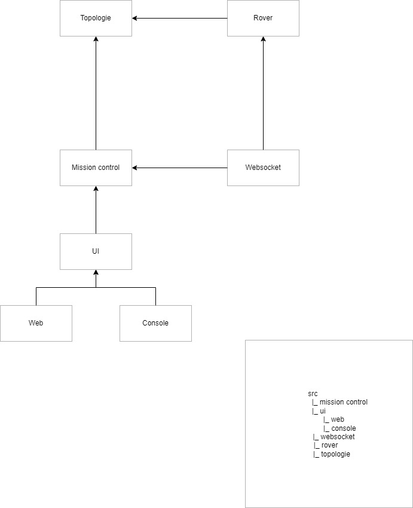

# Projet Rover en Typescript & Websocket

## Equipe:

- Mathis MARIE-CLAIRE
- Colin VARANGE
- César Watrin
- Maxime DIDIER

## Installation

```bash
git clone https://github.com/CesarWatrin/mars-rover-ts-fork.git
```

```bash
npm install
```

## Fonctionnement

### 1. Lancer le serveur

```bash
npm run serve
```

### 2.1 Lancer dans un terminal

```bash
npm run client
```

### 2.2 Lancer dans un navigateur

```bash
npm run dev
```

## Touches de commande web

- `z` : Avancer
- `s` : Reculer
- `q` : Tourner à anti-horaire
- `d` : Tourner à horaire

## Captures d'écran et vidéos

### Schéma d'architecture imaginé



### Gameplay


